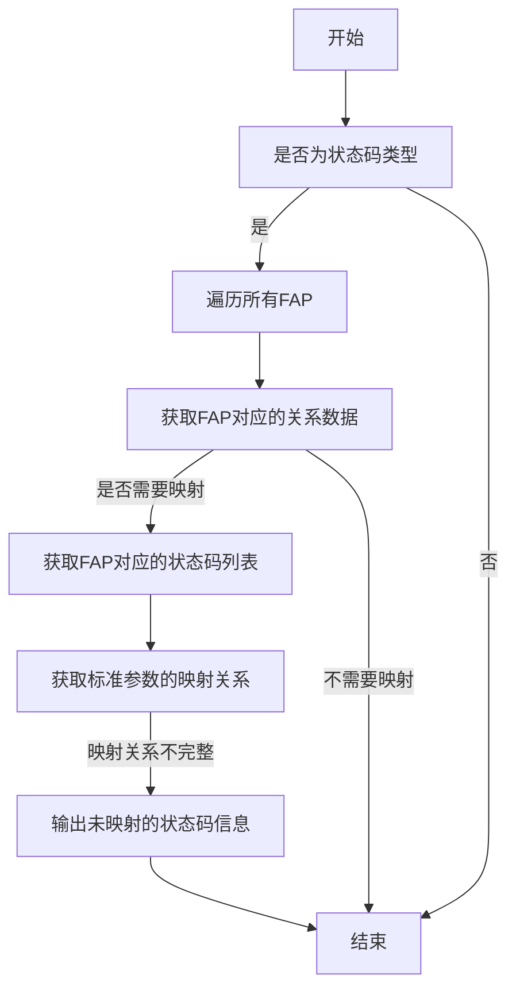
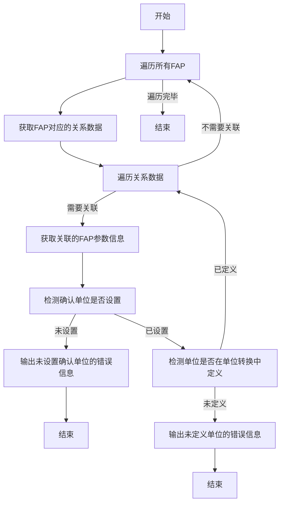

# 单位检测
## 标准参数单位检测

```mermaid
graph TD;
    A[开始] --> B[是否为状态码类型];
    B --> |是| C[遍历所有FAP];
    C --> D[获取FAP对应的关系数据];
    D --> |是否需要映射| E[获取FAP对应的状态码列表];
    E --> F[获取标准参数的映射关系];
    F --> |映射关系不完整| G[输出未映射的状态码信息];
    G --> H[结束];
    D --> |不需要映射| H[结束];
    B --> |否| H[结束];
```
# 单位**检测**
## 标准参数和构型参数关联关系检测

```mermaid
graph TD;
    A[开始] --> B[遍历所有FAP];
    B --> C[获取FAP对应的关系数据];
    C --> D[遍历关系数据];
    D --> |需要关联| E[获取关联的FAP参数信息];
    E --> F[检测确认单位是否设置];
    F --> |未设置| G[输出未设置确认单位的错误信息];
    G --> H[结束];
    F --> |已设置| I[检测单位是否在单位转换中定义];
    I --> |未定义| J[输出未定义单位的错误信息];
    J --> K[结束];
    I --> |已定义| D;
    D --> |不需要关联| B;
    B --> |遍历完毕| L[结束];

```

